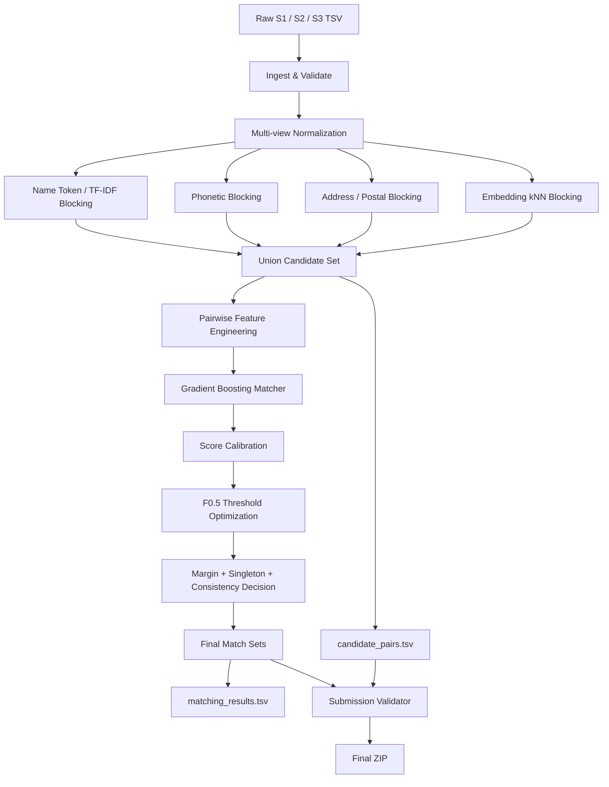

# Amazon ML Challenge 2026 — Business Entity Resolution
## Competition Strategy, Architecture, Implementation Plan, Validation, and Submission Guide

> **Objective:** Build a high-precision entity-resolution system that maps every Source 1 business record to all matching Source 2 and Source 3 records while maximizing the competition's **macro F0.5** score.

This README consolidates the official Amazon ML Challenge 2026 problem statement/guidelines and the strategy shown in the supplied Sonnet 5 response. It is intended to be the single technical blueprint for implementing the solution during the 3-day challenge.

---

# 1. Problem Understanding

The challenge contains three independent business-record sources:

- **Source 1:** deduplicated reference source
- **Source 2:** noisy vendor/source records
- **Source 3:** another noisy vendor/source

There is no common business identifier across sources. For every Source 1 entity, the task is to identify **all** matching Source 2 and Source 3 records.

A Source 1 record may have:

- zero matches,
- one match,
- or multiple matches.

The training data provides:

- `train_source1.tsv`
- `train_source2.tsv`
- `train_source3.tsv`
- `train_ground_truth.tsv`

The test data provides:

- `test_source1.tsv`
- `test_source2.tsv`
- `test_source3.tsv`

All files are TSV files and must be read/written with `sep="\t"`.

---

# 2. Critical Competition Rules

## 2.1 Challenge window

The official guidelines specify:

- **Start:** 25 September 2026, 12:00 AM IST
- **End:** 27 September 2026, 11:59 PM IST

Each team can make a maximum of:

- **5 submissions/day**
- over **3 days**
- for a maximum of **15 leaderboard submissions**

Maintain the history of submitted solutions.

---

## 2.2 Submission artifacts

The final package must contain:

```text
<team_name>_submission.zip
├── output/
│   ├── matching_results.tsv
│   └── candidate_pairs.tsv
│
├── code/
│   └── business_entity_resolution/
│       ├── src/
│       ├── README.md
│       └── requirements.txt
│
└── Documentation_template.md
```

During the challenge, the leaderboard upload is:

```text
matching_results.tsv
```

The final package additionally contains:

```text
candidate_pairs.tsv
runnable source code
requirements.txt
README/documentation
methodology document
```

---

# 3. The Metric: Macro F0.5

The competition evaluates:

\[
F_{0.5} =
\frac{1.25PR}{0.25P + R}
\]

where:

- `P` = precision
- `R` = recall

The score is calculated **per Source 1 entity** and then macro-averaged across all Source 1 entities.

## Why this matters

F0.5 is precision-heavy.

A false positive/false merge is more damaging than a missed match.

Most importantly:

### Singleton behavior

If an S1 entity has no true matches:

```text
True:    {}
Predict: {}
```

then:

```text
F0.5 = 1.0
```

But:

```text
True:    {}
Predict: {some candidate}
```

gives:

```text
F0.5 = 0.0
```

Therefore, **incorrectly adding a match to a true singleton is one of the most expensive mistakes in the competition.**

This means the system must not blindly maximize recall.

The optimization target is:

> **High candidate recall + very high final precision + reliable singleton rejection.**

---

# 4. Core Principle

The entire system should follow:

```text
INGEST
  ↓
NORMALIZE
  ↓
ENSEMBLE BLOCKING
  ↓
CANDIDATE SET
  ↓
PAIRWISE FEATURE ENGINEERING
  ↓
GBM MATCHING MODEL
  ↓
CALIBRATION
  ↓
F0.5-OPTIMIZED DECISION
  ↓
ENTITY-LEVEL / GLOBAL CONSISTENCY PASS
  ↓
OUTPUT VALIDATION
  ↓
matching_results.tsv
candidate_pairs.tsv
```

The core strategic idea is:

> **Cast a wide net cheaply during blocking, then become conservative when committing to final matches.**

---

# 5. High-Level Architecture



---

# 6. Stage 1 — Data Ingestion

Read all TSV files explicitly:

```python
import pandas as pd

s1 = pd.read_csv("dataset/train/train_source1.tsv", sep="\t")
s2 = pd.read_csv("dataset/train/train_source2.tsv", sep="\t")
s3 = pd.read_csv("dataset/train/train_source3.tsv", sep="\t")
gt = pd.read_csv("dataset/train/train_ground_truth.tsv", sep="\t")
```

Never rely on automatic separator detection.

The official statement warns that reading a TSV without `sep="\t"` can silently create one giant column.

---

# 7. Stage 2 — Multi-View Normalization

Do **not** replace the original business name/address with one aggressively normalized string.

Maintain multiple representations.

For every record keep at least:

```text
business_name_raw
business_name_basic
business_name_no_legal_suffix
business_name_token_sorted
business_name_transliterated
business_address_raw
business_address_basic
business_address_tokens
postal_code
house_number
landmark_text
country
source
```

The raw fields should always remain available.

---

# 8. Name Normalization

Recommended basic normalization:

1. Unicode normalization
2. lowercase
3. punctuation removal
4. whitespace collapsing
5. safe transliteration where useful
6. tokenization

Example:

```text
"Acme Robotics, Inc."
        ↓
"acme robotics inc"
```

## Legal suffix handling

Maintain legal suffix families separately.

Examples:

```text
inc
incorporated

corp
corporation

ltd
limited

pvt
private

llc
llp
```

Do not simply delete them and forget they existed.

Create features such as:

```text
legal_suffix_present
legal_suffix_family
same_legal_suffix_family
```

and maintain:

```text
name_normalized_without_suffix
```

This lets the model learn whether a suffix difference is meaningful.

---

# 9. Address Normalization

Addresses require their own pipeline.

Recommended transformations:

```text
lowercase
unicode normalize
punctuation normalize
whitespace normalize
common abbreviation expansion
tokenization
component extraction
```

Examples:

```text
St -> Street
Rd -> Road
Ave -> Avenue
```

Keep this table general and conservative.

Do not create country-specific rules that assume the test set only contains US or India.

---

# 10. Extract Structured Address Components

Useful fields:

```text
house_number
postal_code / PIN
street tokens
city tokens
state / region tokens
landmark tokens
```

Example:

```text
"500 Market St, San Jose, CA"
```

should expose:

```text
house_number = 500
street = market
road_type = st/street
city = san jose
state = ca
```

Structured fields are often more useful to the matching model than one large address string.

---

# 11. Landmark-Aware Address Handling

A key challenge example is a record like:

```text
"Nr. City Hall, San Jose"
```

while another source has:

```text
"500 Market St, San Jose"
```

These may represent the same business even though direct address-string similarity is weak.

Therefore:

- detect landmark phrases,
- keep them as separate fields,
- don't treat low address-string similarity as automatic rejection when name evidence is strong,
- allow name/embedding evidence to rescue landmark-style records.

Potential feature:

```text
landmark_present
```

Potential interaction:

```text
name_similarity × landmark_present
```

---

# 12. Country Handling

The training set contains US and India.

The test set additionally contains France.

Therefore:

## Do NOT do this

```python
if candidate.country != source1.country:
    reject()
```

## Do this instead

Use country as a weak feature:

```text
country_equal = 1 / 0
```

Keep country representation open-ended.

Do not one-hot or hard-code a fixed:

```text
{"US", "India"}
```

logic that prevents France from flowing through the pipeline.

---

# 13. Stage 3 — Ensemble Blocking

Blocking is the most important recall bottleneck.

If a true candidate is absent from the candidate set:

> The final matcher can never recover it.

Therefore:

```text
Candidate Recall = Upper Bound on Final Recall
```

The final `candidate_pairs.tsv` must contain exactly the candidate set that is actually fed into the final matcher.

---

# 14. Blocking Strategy

Use the **union** of multiple blocking channels.

Recommended channels:

```text
1. Name token / TF-IDF blocking
2. Phonetic blocking
3. Address / postal blocking
4. Embedding kNN blocking
```

The union should be conservative.

Do not intersect blockers:

```text
block_A AND block_B
```

unless you have strong evidence that recall remains safe.

Prefer:

```text
candidate_set =
    block_A
    UNION block_B
    UNION block_C
    UNION block_D
```

---

# 15. Blocker A — Token / TF-IDF Name Blocking

Build an inverted index over S2 and S3 name tokens.

Example:

```text
robotics -> [S2-..., S2-..., S3-...]
acme -> [...]
```

Rare tokens are more discriminative than common tokens.

Examples:

```text
"acme robotics"
```

should be driven more by:

```text
robotics
```

than by:

```text
acme
```

Use:

- token TF-IDF,
- word n-grams,
- character n-grams for typo tolerance.

This is the primary workhorse blocker.

---

# 16. Blocker B — Phonetic Blocking

Generate phonetic representations for name tokens.

Possible methods:

- Double Metaphone
- NYSIIS
- another locally computed phonetic encoding

Purpose:

```text
Robotics
Robotix
```

or similarly pronounced variants can enter the same candidate set.

Phonetic blocking is particularly useful when spelling noise causes exact token blocking to fail.

---

# 17. Blocker C — Address / Postal Blocking

Create blocks around:

```text
postal code
house number + street token
rare address token
city + rare token
```

Use postal code when present.

Do not require postal code.

Missing postal data must still be matchable.

Example:

```text
500 market st
500 market street
```

should meet through normalized street evidence.

---

# 18. Blocker D — Embedding kNN

Use a locally available, license-compliant multilingual sentence encoder to encode:

```text
name + address
```

Then retrieve top-k approximate nearest neighbors from S2/S3 using FAISS or another local ANN method.

The supplied Sonnet strategy suggests multilingual embedding models such as:

```text
LaBSE
multilingual-e5-base
bge-m3
```

However:

> **Always verify the exact model/library license used in the final submission against the challenge's MIT/Apache-2.0 requirement before using it.**

Embeddings should be used as local feature extraction / retrieval, not as an external lookup service.

---

# 19. Why Embedding Blocking Is Valuable

String matching handles:

```text
Ltd vs Limited
St vs Street
minor typos
word order changes
```

Embedding similarity can additionally help with:

- multilingual variations,
- semantic similarity,
- transliteration differences,
- address-style differences,
- unseen country patterns such as France.

This is especially valuable because the test distribution includes a country absent from training.

---

# 20. Candidate Union and Deduplication

For each S1 record:

```python
candidates = set()

candidates.update(name_candidates)
candidates.update(phonetic_candidates)
candidates.update(address_candidates)
candidates.update(embedding_candidates)
```

Then remove duplicates.

Store the final set as:

```text
candidate_pairs.tsv
```

Only after all later filtering that occurs **before the final matcher**.

The official rules explicitly define `candidate_pairs.tsv` as the final candidate set actually passed to the model.

---

# 21. Blocking Metrics

Before building a sophisticated matcher, measure:

### Candidate Recall

\[
CandidateRecall =
\frac{\text{true matches included in candidates}}
{\text{all true matches}}
\]

Also measure:

```text
average candidates per S1
median candidates per S1
95th percentile candidate count
maximum candidate count
reduction ratio
```

Target:

> **Very high candidate recall (roughly 98%+ where practical) while keeping candidate lists manageable.**

The exact operating point should be determined from the actual dataset.

Do not chase a candidate count target blindly; measure recall first.

---

# 22. Important Blocking Principle

Blocking should be:

```text
HIGH RECALL
LOW COST
```

Matching should be:

```text
HIGH PRECISION
MORE COMPUTATION
```

This separation is fundamental.

---

# 23. Stage 4 — Pairwise Feature Engineering

For each:

```text
(S1 record, candidate S2/S3 record)
```

create a rich feature vector.

A candidate pair should have:

```text
name features
address features
semantic features
structural features
source features
country features
rarity features
blocking evidence features
conflict features
```

---

# 24. Name Similarity Features

Recommended features:

```text
exact normalized match
exact match without legal suffix
Levenshtein similarity
Jaro-Winkler
token-set similarity
token-sort similarity
token Jaccard
character n-gram cosine
word TF-IDF cosine
LCS ratio
shared token count
shared rare token count
name length difference
name length ratio
phonetic agreement
```

Compute multiple variants:

```text
raw/normalized
with legal suffix
without legal suffix
transliterated
```

---

# 25. Address Similarity Features

Recommended:

```text
Levenshtein
Jaro-Winkler
token Jaccard
token-set ratio
character n-gram cosine
word TF-IDF cosine
shared token count
house-number equality
postal-code equality
postal-prefix agreement where appropriate
city overlap
street overlap
landmark overlap
address length ratio
```

The model should see both:

```text
whole-address similarity
```

and:

```text
structured-component agreement
```

---

# 26. Semantic Similarity Features

For the embedding model used during blocking, reuse the embeddings to compute:

```text
cosine(name + address)
cosine(name only)
cosine(address only)
```

Do not recompute embeddings unnecessarily.

Cache them.

---

# 27. Source-Pair Feature

Add:

```text
source_pair_type
```

such as:

```text
S1-S2
S1-S3
```

because Source 2 and Source 3 may have different noise patterns.

This allows the model to learn different distributions.

---

# 28. Country Features

Use:

```text
country_equal
```

and possibly:

```text
country_missing_on_either_side
```

Do not make country a hard filter.

---

# 29. Conflict Features

False merges often come from a strong single field and weak evidence elsewhere.

Useful conflict features:

```text
high_name_low_address
low_name_high_address
name_address_disagreement
```

Example:

```text
name_similarity = 0.98
address_similarity = 0.15
```

This should be treated differently from:

```text
name_similarity = 0.88
address_similarity = 0.84
```

The model needs an explicit way to see this conflict.

---

# 30. Blocking-Evidence Features

For every candidate, count how many independent blocking channels found it.

Example:

```text
exact_name_block = 1
phonetic_block = 1
address_block = 1
embedding_block = 1
```

Then:

```text
blocking_channel_count = 4
```

Also create weighted variants if useful.

A candidate found independently by multiple channels is often more trustworthy than one surfaced by only one weak channel.

---

# 31. Rare-Token Features

Compute token frequency across the candidate corpus.

For each candidate pair:

```text
name_rare_token_overlap
address_rare_token_overlap
minimum_token_idf
maximum_token_idf
sum_shared_token_idf
```

Rare evidence should contribute more than common evidence.

Example:

```text
"market"
```

is weak.

A highly distinctive business token is stronger.

---

# 32. Entity-Level / Ranking Features

Pairwise models benefit from knowing how a candidate compares to the other candidates for the same S1.

For each S1, calculate:

```text
candidate_rank
top_score
second_score
score_margin
score_gap_from_top
number_above_threshold
```

Example:

```text
top = 0.95
second = 0.94
```

is much more ambiguous than:

```text
top = 0.95
second = 0.41
```

This is critical for thresholding.

---

# 33. Stage 5 — Training Labels

Positive pairs:

```text
ground_truth match
```

that are present in the candidate set.

Negative pairs:

```text
candidate pair not in ground truth
```

Do not train only on random negatives.

The useful negatives are the hard ones.

---

# 34. Hard Negative Mining

Create difficult negatives such as:

```text
same / similar business name
different address

same / similar address
different business name

same city
similar name

same postal code
similar name

very high fuzzy similarity
but not a true match
```

Examples:

```text
Acme Bakery
Acme Robotics
```

or:

```text
ABC Foods Ltd
ABC Foods LLC
```

when the records correspond to different entities.

Hard negatives teach the model to avoid false merges.

---

# 35. Why Hard Negatives Matter

A random negative such as:

```text
Acme Robotics
Joe's Pizza
```

is too easy.

The model already knows they differ.

The difficult cases are:

```text
Acme Robotics
Acme Robotix
```

or:

```text
Acme Robotics
Acme Robotics LLC
```

with contradictory address evidence.

These are exactly the cases that determine F0.5.

---

# 36. Train / Validation Split

Split at the **Source 1 entity level**.

Do NOT randomly split candidate pairs.

Bad:

```text
same S1
some pairs -> train
other pairs -> validation
```

This creates entity-level leakage.

Good:

```text
S1 entities -> train
S1 entities -> validation
```

All candidates belonging to an S1 entity stay in one side.

---

# 37. Matching Model

Recommended primary model:

```text
LightGBM
```

or:

```text
XGBoost
```

as a gradient-boosted binary classifier:

```text
match = 1
no_match = 0
```

These models are a strong fit because the features combine:

- continuous similarities,
- binary exact matches,
- counts,
- structured agreement,
- missingness,
- source indicators,
- ranking features.

The competition's model/license rule should be checked for every dependency/model selected.

---

# 38. Model Design

A practical initial model:

```text
objective = binary classification
class imbalance = handled via weighting/sampling
early stopping = enabled
```

Do not spend most of the 3-day window hyperparameter-tuning hundreds of configurations.

Focus on:

1. features
2. candidate quality
3. hard negatives
4. threshold policy
5. error analysis

These are generally higher leverage.

---

# 39. Calibration

Gradient-boosting scores are useful ranking signals, but the raw score should not automatically be interpreted as a reliable probability.

Use out-of-fold validation predictions to test:

```text
Platt / sigmoid calibration
Isotonic regression
```

Then evaluate whether calibrated probabilities improve:

```text
macro F0.5
singleton behavior
threshold stability
```

Do not assume calibration helps; validate it.

---

# 40. Stage 6 — F0.5-Tuned Decision Policy

Never assume:

```python
match if probability > 0.5
```

The optimal threshold is competition-specific.

Tune directly against:

```text
macro F0.5
```

including the special singleton rule.

Suggested grid:

```text
0.50
0.55
0.60
...
0.95
```

Then refine around the best region.

Use the same exact local scorer for every experiment.

---

# 41. Exact Local F0.5 Evaluator

Implement:

```python
def entity_f05(true_ids, pred_ids):
    true_ids = set(true_ids)
    pred_ids = set(pred_ids)

    if not true_ids and not pred_ids:
        return 1.0

    if not true_ids and pred_ids:
        return 0.0

    tp = len(true_ids & pred_ids)
    precision = tp / len(pred_ids) if pred_ids else 0.0
    recall = tp / len(true_ids) if true_ids else 0.0

    if precision == 0.0 or recall == 0.0:
        return 0.0

    return (1.25 * precision * recall) / (0.25 * precision + recall)
```

Then:

```python
macro_f05 = mean(
    entity_f05(true[s1_id], pred[s1_id])
    for s1_id in all_source1_ids
)
```

This scorer should be treated as a first-class component of the pipeline.

---

# 42. Do Not Optimize Only for Pairwise F1

Possible metrics:

```text
accuracy
ROC-AUC
PR-AUC
pairwise F1
```

can still be useful diagnostics.

But the final threshold decision must be based on:

```text
competition macro F0.5
```

not those proxy metrics.

---

# 43. Margin-Based Decision Rule

Suppose the highest candidates are:

```text
0.93
0.92
0.91
```

This is ambiguous.

Compare:

```text
0.93
0.40
0.31
```

which is much clearer.

Therefore consider:

```text
accept if
    score >= threshold
AND
    top/second margin >= learned margin
```

The margin should be tuned using validation.

Do not create a fixed margin just because it sounds reasonable.

---

# 44. Explicit Singleton Awareness

Do not treat:

```text
no candidate passed the threshold
```

as an accidental singleton detector.

Build explicit entity-level signals such as:

```text
top candidate score
second candidate score
max name similarity
max address similarity
max semantic similarity
number of high-confidence candidates
candidate count
candidate evidence count
```

Then make a conservative:

```text
"Does this S1 have any credible counterpart?"
```

decision.

This can substantially reduce expensive false positives on true singletons.

---

# 45. Example Singleton Logic

Conceptually:

```text
if no credible candidate:
    return []

if top_score is weak:
    return []

if top_score is strong but evidence conflicts:
    return []

otherwise:
    continue to candidate-level acceptance
```

The exact thresholds must come from validation.

---

# 46. Cross-Source Consistency

The supplied strategy suggests an additional global consistency stage.

Because S1 is the deduplicated reference source, inspect the training data to determine whether a Source 2 or Source 3 record ever legitimately links to multiple S1 entities.

If the training data supports an effectively one-to-one usage of an S2/S3 record with S1, add a conflict-resolution rule:

```text
same candidate ID
    ↓
claimed by multiple S1 entities
    ↓
keep strongest claim
```

This should be treated as a **training-data-derived constraint**, not a blindly assumed rule.

If training shows that multiple S1 mappings are valid, do not enforce exclusivity.

---

# 47. Pairwise Score + Global Consistency

Final scoring can conceptually be:

```text
pair_score
+
cross-source evidence
+
ambiguity features
+
consistency rules
```

Do not automatically convert every transitive relationship into a match.

For example:

```text
S1 ↔ S2
S2 ↔ S3
```

does NOT automatically mean:

```text
S1 ↔ S3
```

Use cross-source relationships as evidence features unless the training data proves a safe transitivity rule.

---

# 48. Recommended Ensemble Architecture

The strongest practical architecture for the challenge is:

```text
                 INGEST & NORMALIZE
                        │
                        ▼
              ┌─────────────────────┐
              │ Ensemble Blocking   │
              │                     │
              │ Token / TF-IDF      │
              │ Phonetic            │
              │ Address / Postal    │
              │ Embedding kNN       │
              └──────────┬──────────┘
                         │
                         ▼
                  Candidate Union
                         │
                         ▼
             Pairwise Feature Engine
                         │
                         ▼
                 LightGBM / XGB
                         │
                         ▼
                    Calibration
                         │
                         ▼
               F0.5 Threshold Tuning
                         │
                         ▼
         Margin + Singleton + Consistency
                         │
                         ▼
                 Final Match Sets
```

---

# 49. Suggested Feature Groups

For implementation, maintain feature groups:

```text
features_name.py
features_address.py
features_semantic.py
features_metadata.py
features_blocking.py
features_entity_level.py
```

This makes experimentation easy.

---

# 50. Efficient Implementation

Avoid recomputing expensive operations inside nested loops.

## Cache:

```text
normalized strings
tokens
phonetic forms
TF-IDF vectors
embeddings
postal codes
structured address fields
```

## Vectorize where possible

Use:

```text
pandas / polars
scikit-learn
RapidFuzz
SciPy sparse matrices
FAISS
```

where appropriate.

---

# 51. Recommended Project Structure

```text
business_entity_resolution/
│
├── README.md
├── requirements.txt
│
├── src/
│   ├── config.py
│   │
│   ├── data_io.py
│   ├── validation.py
│   │
│   ├── normalization.py
│   ├── address_parser.py
│   ├── phonetic.py
│   │
│   ├── blocking/
│   │   ├── token_blocking.py
│   │   ├── phonetic_blocking.py
│   │   ├── address_blocking.py
│   │   ├── embedding_blocking.py
│   │   └── ensemble.py
│   │
│   ├── features/
│   │   ├── name_features.py
│   │   ├── address_features.py
│   │   ├── semantic_features.py
│   │   ├── metadata_features.py
│   │   ├── blocking_features.py
│   │   └── entity_features.py
│   │
│   ├── model/
│   │   ├── train.py
│   │   ├── calibrate.py
│   │   └── predict.py
│   │
│   ├── decision/
│   │   ├── threshold.py
│   │   ├── singleton.py
│   │   └── consistency.py
│   │
│   ├── evaluation/
│   │   ├── f05.py
│   │   ├── blocking_recall.py
│   │   └── error_analysis.py
│   │
│   └── pipeline.py
│
└── experiments/
    ├── configs/
    ├── metrics/
    └── logs/
```

---

# 52. End-to-End Pseudocode

```python
# 1. Load
train_s1, train_s2, train_s3, train_gt = load_train()
test_s1, test_s2, test_s3 = load_test()

# 2. Normalize
train_s1 = normalize_records(train_s1)
train_s2 = normalize_records(train_s2)
train_s3 = normalize_records(train_s3)

# 3. Split by Source-1 entity
train_ids, val_ids = split_source1_entities(train_s1)

# 4. Build candidate set
train_candidates = ensemble_block(
    train_s1,
    train_s2,
    train_s3
)

# 5. Measure blocking recall
blocking_metrics = evaluate_blocking(
    train_candidates,
    train_gt,
    val_ids
)

# 6. Build pairwise features
X_train, y_train = build_training_pairs_and_features(
    train_s1,
    train_s2,
    train_s3,
    train_candidates,
    train_gt,
    train_ids
)

# 7. Hard-negative mining
X_train, y_train = add_hard_negatives(
    X_train,
    y_train
)

# 8. Train model
model = train_gbm(X_train, y_train)

# 9. Calibrate
calibrator = fit_calibrator(
    model,
    validation_pairs
)

# 10. Predict validation
val_scores = predict_and_calibrate(
    model,
    calibrator,
    val_features
)

# 11. Tune threshold / margin
policy = tune_f05_policy(
    val_scores,
    val_ground_truth
)

# 12. Entity-level decision
val_predictions = apply_decision_policy(
    val_scores,
    policy
)

# 13. Evaluate
metrics = evaluate_entity_level(
    val_predictions,
    val_ground_truth
)

# 14. Train final model
final_model = retrain_on_all_training_data(...)

# 15. Generate test candidates
test_candidates = ensemble_block(
    test_s1,
    test_s2,
    test_s3
)

# 16. Build final features
test_features = build_features(...)

# 17. Score
test_scores = final_model.predict_proba(test_features)

# 18. Final decision
final_matches = apply_decision_policy(
    test_scores,
    policy
)

# 19. Global consistency
final_matches = resolve_conflicts(
    final_matches,
    training_derived_constraints
)

# 20. Write outputs
write_matching_results(final_matches)
write_candidate_pairs(test_candidates)

# 21. Validate
run_submission_validator()
```

---

# 53. Local Evaluation Dashboard

Every experiment should log at least:

```text
candidate_recall
average_candidate_count
median_candidate_count
pairwise_precision
pairwise_recall
macro_F0.5
singleton_accuracy
singleton_F0.5
S1-S2 F0.5
S1-S3 F0.5
```

Also record:

```text
threshold
margin
source thresholds
model version
feature version
blocking version
```

---

# 54. Error Analysis

Maintain two primary reports.

## False Positive report

Columns:

```text
s1_id
candidate_id
true_match
predicted_score
name_similarity
address_similarity
semantic_similarity
blocking_channels
```

Look for:

```text
same business name, different location
same building/address, different business
chain/franchise collision
abbreviation collision
common company name
landmark ambiguity
```

## False Negative report

Columns:

```text
s1_id
true_candidate
was_candidate_generated?
highest_score
blocking_method
```

This separates:

```text
blocking failure
```

from:

```text
matching failure
```

---

# 55. How to Interpret Errors

### True match not in candidate set

Fix:

```text
blocking
normalization
embedding retrieval
phonetic blocking
address blocking
```

### True match in candidate set but rejected

Fix:

```text
features
model
hard negatives
threshold
calibration
```

### Wrong match accepted

Fix:

```text
precision threshold
margin
hard negatives
conflict features
singleton detection
global consistency
```

This makes iteration scientific instead of random.

---

# 56. SHAP / Feature Importance

If time permits, inspect the matcher using:

```text
SHAP
feature importance
```

Questions to answer:

- Is the model overusing country?
- Is address evidence underweighted?
- Are embeddings dominating?
- Are rare-token signals useful?
- Are conflict features working?
- Is the model mostly using one field?

If the model relies heavily on US/India-specific features, that's a warning sign for France generalization.

---

# 57. France Generalization Checklist

Before final submission confirm:

```text
[ ] no US/India hard-coded filter
[ ] country not used as an exclusion rule
[ ] open-set country handling
[ ] Unicode normalization works
[ ] accented characters work
[ ] multilingual embeddings, if used, are genuinely multilingual
[ ] address normalization is generic
[ ] test records from every country are included
```

Every Source 1 test entity must receive exactly one output row.

---

# 58. Output Format

## matching_results.tsv

Exactly:

```text
source1_entity_id<TAB>matched_entity_ids
```

Example:

```text
S1-00001    S2-00047,S2-00193,S3-00812
S1-00002    S3-00004
S1-00003
```

For a singleton:

```text
S1-00003
```

leave `matched_entity_ids` empty.

---

# 59. candidate_pairs.tsv

Exactly:

```text
source1_entity_id<TAB>candidate_entity_ids
```

Example:

```text
S1-00001    S2-00047,S2-00193,S3-00812,S3-00999
S1-00002    S3-00004
S1-00003
```

The final matches must be a subset of candidate IDs.

---

# 60. Submission Rules Checklist

Before upload verify:

```text
[ ] Every Source 1 test ID appears exactly once
[ ] No duplicate Source 1 rows
[ ] No duplicate matched IDs
[ ] matched IDs only contain S2/S3 IDs
[ ] all matched IDs exist in test data
[ ] every final match appears in candidate_pairs.tsv
[ ] candidate IDs contain only S2/S3 IDs
[ ] singleton rows have empty ID list
[ ] files are TSV
[ ] exact column names are used
[ ] candidate_pairs.tsv is the final model-input candidate set
```

---

# 61. Always Run the Official Validator

Run:

```bash
python3 utils/validate_submission.py \
    --matching output/matching_results.tsv \
    --candidate output/candidate_pairs.tsv \
    --test-dir dataset/test
```

A `PASS` means the files satisfy structural rules.

It does not compute your score.

Never spend a leaderboard submission on an output that has not passed the validator.

---

# 62. 3-Day Competition Plan

## Day 1 — Build an end-to-end baseline

### Goal

Get a functioning pipeline and first leaderboard score.

Implement:

```text
TSV loading
normalization
token/TF-IDF blocking
basic address blocking
5–10 important features
LightGBM baseline
F0.5 scorer
threshold tuning
output generation
validator
```

Do not spend all of Day 1 on fancy modeling.

The first end-to-end pipeline should work.

---

## Day 2 — Increase recall and matching quality

Add:

```text
phonetic blocking
embedding blocking
full feature set
hard-negative mining
calibration
margin logic
singleton decision layer
cross-source consistency
```

Re-run local evaluation after every major change.

---

## Day 3 — Precision and finalization

Focus on:

```text
false positives
singleton errors
threshold stability
France/generalization
hard-negative refinement
SHAP/error analysis
output verification
documentation
reproducibility
```

Do not introduce a completely new architecture late on Day 3 unless validation clearly shows a major gain.

---

# 63. Submission Strategy

There are up to 5 submissions per day.

Use them as controlled experiments.

Example:

### Day 1

```text
Submission 1:
basic blocking + basic GBM

Submission 2:
better blocking

Submission 3:
hard negatives

Submission 4:
threshold tuning

Submission 5:
best validated version
```

### Day 2

Experiment with:

```text
embedding blocker
calibration
source thresholds
singleton policy
```

### Day 3

Only submit candidates that are justified by local validation.

Do not overfit to public leaderboard fluctuations.

---

# 64. Public vs Private Leaderboard

The challenge has:

- Public leaderboard during the challenge
- Private leaderboard after the challenge

The public leaderboard is based on only part of the hidden test data.

Therefore:

```text
Local validation = primary decision source
Public leaderboard = secondary signal
```

Do not continuously tune against public rank.

A public improvement that harms local validation may be overfitting the public subset.

---

# 65. Recommended Experiment Table

Keep a CSV/JSON log such as:

```text
experiment_id
date_time
blocker_version
feature_version
model
calibration
threshold
margin
candidate_recall
precision
recall
macro_f05
singleton_f05
public_score
notes
```

Example:

```text
E07
ensemble-v2
features-v4
LightGBM
isotonic
0.83
0.06
0.989
0.965
0.941
0.958
0.981
...
```

This prevents losing the best configuration.

---

# 66. High-Value Optimizations in Priority Order

Recommended order:

```text
1. Candidate recall
2. False-positive suppression
3. Hard-negative mining
4. Entity-level thresholding
5. Name + address features
6. Singleton detection
7. Cross-source consistency
8. Calibration
9. Model ensemble
10. Micro hyperparameter tuning
```

Do not reverse this order.

---

# 67. What NOT to Do

Avoid building the competition around:

## Pure exact matching

Too brittle.

## One fuzzy similarity score

Too many false positives.

## One global 0.5 threshold

Not aligned with F0.5.

## Name-only matching

High collision risk.

## Address-only matching

Shared buildings / landmarks / incomplete addresses cause errors.

## Hard country filters

Break open-set France handling.

## Random pair train/validation split

Causes leakage.

## External enrichment

Strictly prohibited.

Do not use:

- business lookup APIs,
- commercial entity-resolution APIs,
- government business registries,
- geocoding APIs,
- internet-based business identity enrichment.

The challenge explicitly prohibits external data lookup and can disqualify approaches that use it.

---

# 68. External Data Prohibition

The model must work using the supplied challenge data.

Permitted conceptually:

```text
local string processing
local ML models
local embeddings
local ANN search
local phonetic libraries
local feature engineering
```

Not permitted:

```text
Google Maps / geocoding
business registry lookups
commercial ER APIs
internet searches for company identity
external business databases
```

If a library downloads external business data or calls an external service at runtime, do not use it.

---

# 69. Model and License Compliance

The final model must comply with the competition requirement:

```text
MIT/Apache 2.0 license
≤ 8 billion parameters
```

Before submission, record:

```text
model name
version
license
parameter count
```

For pretrained embedding models, verify the exact model's license from its official model/package metadata before including it in the final submission.

---

# 70. Recommended Baseline

The fastest sensible baseline:

```text
Normalization
      ↓
Name TF-IDF blocking
      ↓
Address blocking
      ↓
~20 strong features
      ↓
LightGBM
      ↓
F0.5 threshold tuning
      ↓
Output
```

This establishes a benchmark.

---

# 71. Recommended Competition Version

The strongest planned version:

```text
Multi-view normalization
        +
Token / TF-IDF blocking
        +
Phonetic blocking
        +
Address / postal blocking
        +
Embedding kNN blocking
        +
Rich pairwise features
        +
Hard negative mining
        +
LightGBM / XGBoost
        +
Calibration
        +
F0.5 threshold optimization
        +
Score-margin filtering
        +
Singleton detection
        +
Training-derived cross-source consistency
        +
Output validation
```

---

# 72. Final Decision Philosophy

For every candidate pair, conceptually ask:

> How much independent evidence says these are the same business?

And for every Source 1:

> How confident am I that this entity has any valid match at all, and how clearly do the best candidates separate from the rest?

This is better than asking only:

> Is this pair's fuzzy similarity above 0.5?

---

# 73. The Most Important Design Insight

The competition is not simply:

```text
"Which model gives the best pairwise classification?"
```

It is:

```text
"How do we construct the right candidate universe,
score candidates accurately,
and make the least damaging final set decision
under macro F0.5?"
```

That means the winning effort is distributed across:

```text
blocking
+
features
+
hard negatives
+
threshold policy
+
singleton logic
+
consistency
```

rather than only model architecture.

---

# 74. Final Blueprint

Use this as the implementation contract:

```text
                  ┌─────────────────────────────┐
                  │     S1 / S2 / S3 TSVs      │
                  └──────────────┬──────────────┘
                                 │
                                 ▼
                  ┌─────────────────────────────┐
                  │ Ingest + schema validation  │
                  └──────────────┬──────────────┘
                                 │
                                 ▼
                  ┌─────────────────────────────┐
                  │ Multi-view normalization    │
                  │ name + address + structure  │
                  └──────────────┬──────────────┘
                                 │
              ┌──────────────────┼──────────────────┐
              ▼                  ▼                  ▼
      Token / TF-IDF       Phonetic           Address / Postal
              │                  │                  │
              └──────────────────┼──────────────────┘
                                 │
                                 ▼
                       Embedding kNN blocker
                                 │
                                 ▼
                    ┌────────────────────────┐
                    │ UNION candidate set    │
                    └────────────┬───────────┘
                                 │
                                 ▼
                    Candidate recall evaluation
                                 │
                                 ▼
                    Pairwise feature engineering
                                 │
              ┌──────────────────┼─────────────────────┐
              ▼                  ▼                     ▼
          String              Structural            Semantic
          features             features              features
              │                  │                     │
              └──────────────────┼─────────────────────┘
                                 │
                                 ▼
                       Hard negative training
                                 │
                                 ▼
                        LightGBM / XGBoost
                                 │
                                 ▼
                             Calibration
                                 │
                                 ▼
                       F0.5 threshold tuning
                                 │
                                 ▼
                    Margin + singleton decision
                                 │
                                 ▼
                  Training-derived consistency pass
                                 │
                                 ▼
                       Final match sets
                         /           \
                        /             \
                       ▼               ▼
           matching_results.tsv   candidate_pairs.tsv
                       \               /
                        \             /
                         ▼           ▼
                         Validator
                            │
                            ▼
                       Final ZIP package
```

---

# 75. Final Checklist Before Submission

## Data

- [ ] All TSV files read with tab separator
- [ ] Source prefixes handled correctly
- [ ] Open-set country handling
- [ ] Raw values preserved

## Normalization

- [ ] Multiple name representations
- [ ] Legal suffix handling
- [ ] Address normalization
- [ ] Postal extraction
- [ ] House-number extraction
- [ ] Landmark handling

## Blocking

- [ ] Name token blocking
- [ ] TF-IDF / character retrieval
- [ ] Phonetic blocking
- [ ] Address blocking
- [ ] Embedding blocking if beneficial
- [ ] Union of blockers
- [ ] Candidate recall measured
- [ ] Candidate counts measured

## Matching

- [ ] Rich pairwise features
- [ ] Hard negative mining
- [ ] LightGBM/XGBoost
- [ ] Calibration tested
- [ ] F0.5 threshold tuned
- [ ] Margin rule evaluated
- [ ] Singleton logic
- [ ] Cross-source consistency validated against training data

## Validation

- [ ] Split by S1 entity
- [ ] Exact macro F0.5 implemented
- [ ] Singleton rule implemented
- [ ] False positive report
- [ ] False negative report
- [ ] France/open-set checks

## Output

- [ ] Every S1 test record has one row
- [ ] Empty match list for predicted singleton
- [ ] No duplicates
- [ ] Only S2/S3 IDs in matches
- [ ] Every match exists in candidate set
- [ ] Candidate file represents final model-input candidates
- [ ] Official validator returns PASS

## Reproducibility

- [ ] README included
- [ ] Source code included
- [ ] requirements.txt pinned
- [ ] model versions recorded
- [ ] licenses recorded
- [ ] experiment history retained

---

# 76. One-Line Strategy

> **Generate a very high-recall candidate set with multiple independent blockers, learn a precision-focused pairwise matcher from hard negatives, calibrate and tune its decision policy directly for macro F0.5, explicitly protect true singletons, and apply only consistency rules proven safe on the training data.**

---

# 77. Source Notes

This README is based primarily on:

1. **Amazon ML Challenge 2026 official guidelines**
2. **Amazon ML Challenge 2026 Business Entity Resolution problem statement**
3. **Amazon ML Challenge 2026 visual/video walkthrough supplied with the challenge**
4. **The supplied Sonnet 5 strategy response and architecture diagram**

Important distinctions:

- The competition rules, file formats, metric, singleton behavior, output requirements, open-set country requirement, model/license constraint, and external-data prohibition are derived from the official challenge materials.
- The multi-channel architecture, multilingual embedding blocker, calibration, margin logic, and other engineering techniques are strategy recommendations.
- Any global uniqueness/one-to-one constraint involving S2/S3 records should be **validated from the provided training data before being enforced**.
- Any pretrained embedding model or library used in the final package must have its exact license checked for compliance.

---

# 78. Immediate Implementation Order

When the real dataset is available, follow this exact sequence:

```text
STEP 1
Profile dataset

STEP 2
Build normalization

STEP 3
Implement exact/TF-IDF blockers

STEP 4
Measure blocking recall

STEP 5
Add phonetic + address blockers

STEP 6
Measure blocking recall again

STEP 7
Add embedding blocker if it improves recall / difficult cases

STEP 8
Build pairwise features

STEP 9
Create hard negatives

STEP 10
Train baseline GBM

STEP 11
Implement exact macro F0.5

STEP 12
Tune threshold

STEP 13
Add margin logic

STEP 14
Add singleton model/policy

STEP 15
Test calibration

STEP 16
Test consistency constraints using training evidence

STEP 17
Run complete validation

STEP 18
Generate test candidates and predictions

STEP 19
Run official validator

STEP 20
Freeze final experiment and package everything
```

Do not skip Step 4.

**If the blocker is weak, the matcher cannot save the solution.**
